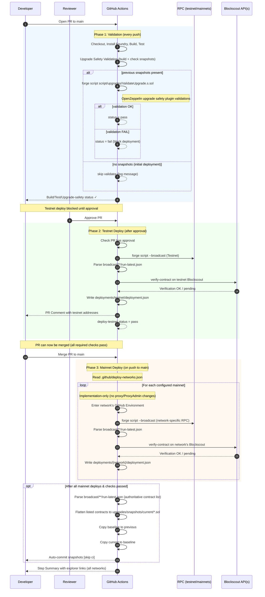
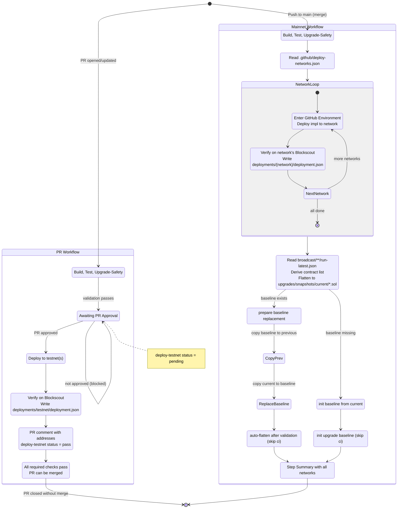

# Technical Spec — Auto CI/CD: Testnet & Mainnet Deployments With Upgrade Safety Validation (Foundry + Blockscout)

## 1. Background

### Problem Statement: What hurts today?

* Manual, inconsistent deployments of smart contracts across environments.
* Frontend team might be blocked by contract deployment details.
* Risky upgrades without automated safety checks.
* Fragmented verification (Etherscan vs Blockscout) and inconsistent artifacts/summaries.

### Context / History

* Current repo uses Foundry for build/test and deployment (`forge`, `cast`, `forge script`).
* Reference workflows provided for:

  * **Testnet**: deploy on **approved** PR to `main`. Testnet deployment is gated behind PR approval and is a required status check for merging.
  * **Mainnet(s) (configurable)**: deploy on push/merge to `main` under protected environment(s). Supports multiple mainnet targets (e.g., Ethereum, Arbitrum, Base) configured per-repo.
  * **Upgrade safety validation** via flattened previous/current contracts and `script/upgrades/ValidateUpgrade.s.sol`.
  * **Flattening** On pushes to `main` only (after tests and upgrade-safety pass), CI flattens all contracts listed in `broadcast/**/run-latest.json` to `upgrades/snapshots/current/`, then backs up that snapshot to `upgrades/snapshots/previous/` and auto-commits the changes. The set of contracts to flatten is derived only from Foundry's broadcast artifact `broadcast/**/run-latest.json`. This file is the authoritative source of truth for flattening paths and for deployment address summaries.
* Direction: **adopt Blockscout verification** and **drop Etherscan** support.
* Intended to be reused across multiple repos; not for continuous auto-upgrades of production, but to guarantee end-to-end deployability and unblock frontends.
* **Reusable composite GitHub Action:** All CI/CD steps (build/test, upgrade-safety, deploy, verify, summarize, artifacts) are consumed via a single composite action. Workflows become thin wrappers that invoke the action with network-specific inputs.
* **Per-repo triggers configurable:** Each repo chooses its own triggers (`pull_request`, `push`, `release`, `workflow_dispatch`) and networks via workflow inputs.

### Standardized Deployment Script

To make workflows reusable across repos, CI expects a **canonical wrapper**:

- **Entry point (name):** `script/Deploy.s.sol:Deploy`
- **Invocation (canonical):**
  ```bash
  forge script script/Deploy.s.sol:Deploy \
    --rpc-url "$RPC_URL" \
    --broadcast \
    --slow \
    -vvvv
  ```

**Env mapping (CI):** the workflow must export `PRIVATE_KEY` and `RPC_URL` from the environment-specific secrets. For multi-mainnet deployments, each network has its own secret set:

| Network | Private Key Secret | RPC URL Secret |
|---------|-------------------|----------------|
| Testnet | `TESTNET_PRIVATE_KEY` | `TESTNET_RPC_URL` |
| Ethereum Mainnet | `MAINNET_PRIVATE_KEY` | `MAINNET_RPC_URL` |
| Arbitrum | `ARBITRUM_PRIVATE_KEY` | `ARBITRUM_RPC_URL` |
| Base | `BASE_PRIVATE_KEY` | `BASE_RPC_URL` |
| *(additional networks)* | `{NETWORK}_PRIVATE_KEY` | `{NETWORK}_RPC_URL` |

The naming convention is `{NETWORK_NAME}_PRIVATE_KEY` and `{NETWORK_NAME}_RPC_URL` where `NETWORK_NAME` is uppercase (e.g., `ARBITRUM`, `BASE`, `OPTIMISM`).

**Deployment artifact schema (output)** CI will parse the Foundry broadcast artifact to extract deployed addresses.

  ```json
  {
    "contracts": [
      { "sourcePathAndName": "src/Greeter.sol:Greeter", "address": "0x..." }
    ]
  }
  ```

This is the output written to `deployments/{network}/deployment.json`, derived by parsing Foundry's `broadcast/**/run-latest.json`. For multi-mainnet deployments, each network gets its own artifact file (e.g., `deployments/ethereum/deployment.json`, `deployments/arbitrum/deployment.json`, `deployments/base/deployment.json`).

* **Deploy script (example):**

```solidity
// SPDX-License-Identifier: MIT
pragma solidity ^0.8.25;

import "forge-std/Script.sol";
import "forge-std/console2.sol";

import {ProxyAdmin} from "@openzeppelin/contracts/proxy/transparent/ProxyAdmin.sol";
import {TransparentUpgradeableProxy} from "@openzeppelin/contracts/proxy/transparent/TransparentUpgradeableProxy.sol";

import {Greeter} from "src/Greeter.sol";

contract Deploy is Script {
  function run() external {
        // Minimal assumption: a PRIVATE_KEY is provided to broadcast
        uint256 pk = vm.envUint("PRIVATE_KEY");
        require(pk != 0, "PRIVATE_KEY required");

        vm.startBroadcast(pk);

        ProxyAdmin admin = new ProxyAdmin();
        console2.log("ProxyAdmin", address(admin));

        Greeter impl = new Greeter();
        console2.log("Greeter_Implementation", address(impl));

        bytes memory initData = abi.encodeWithSelector(Greeter.initialize.selector, "Hello, world!");

        TransparentUpgradeableProxy proxy =
            new TransparentUpgradeableProxy(address(impl), address(admin), initData);
        console2.log("Greeter_Proxy", address(proxy));

        vm.stopBroadcast();
  }
}

```


**Compiler configuration (repo-level requirement)**

The repository's `foundry.toml` must set:

- `bytecode_hash = "none"`
- `cbor_metadata = false`

These settings are required for deterministic bytecode and constructor-arg extraction. CI will validate that builds use this configuration and fail otherwise.

### Multi-Mainnet Configuration

Repositories can configure deployment to multiple mainnet networks. Each network deployment runs as a separate job within the same workflow, allowing parallel or sequential execution based on configuration.

**Configuration file:** `.github/deploy-networks.json`

```json
{
  "testnets": [
    {
      "name": "sepolia",
      "chain_id": 11155111,
      "blockscout_url": "https://eth-sepolia.blockscout.com",
      "environment": "testnet"
    }
  ],
  "mainnets": [
    {
      "name": "ethereum",
      "chain_id": 1,
      "blockscout_url": "https://eth.blockscout.com",
      "environment": "production-ethereum"
    },
    {
      "name": "arbitrum",
      "chain_id": 42161,
      "blockscout_url": "https://arbitrum.blockscout.com",
      "environment": "production-arbitrum"
    },
    {
      "name": "base",
      "chain_id": 8453,
      "blockscout_url": "https://base.blockscout.com",
      "environment": "production-base"
    }
  ]
}
```

**Configuration schema:**

| Field | Type | Required | Description |
|-------|------|----------|-------------|
| `name` | string | Yes | Network identifier (lowercase). Used in artifact paths and secret names. |
| `chain_id` | number | Yes | EVM chain ID for the network. |
| `blockscout_url` | string | Yes | Base URL for the Blockscout instance for this network. |
| `environment` | string | Yes | GitHub Environment name containing secrets for this network. |

**Execution behavior:**

- **PR to `main` (testnet):** Deploys to all configured testnets in parallel, **but only after the PR is approved**. The testnet deployment job is a required status check that blocks merging.
- **Push to `main` (mainnet):** Deploys to all configured mainnets. Each mainnet deployment:
  - Runs in its own GitHub Environment (with optional manual approval per environment)
  - Uses network-specific secrets (`{NETWORK}_PRIVATE_KEY`, `{NETWORK}_RPC_URL`)
  - Writes artifacts to `deployments/{network}/deployment.json`
  - Verifies on the network's Blockscout instance
- **Job independence:** Each network deployment is an independent job. A failure on one network does not block other networks (configurable via `fail-fast: false`).
- **Shared upgrade-safety:** Upgrade-safety validation runs once before all deployments. All networks share the same contract bytecode.

**Secrets per environment:**

Each GitHub Environment (e.g., `production-ethereum`, `production-arbitrum`) must contain:
- `PRIVATE_KEY` — Deployer wallet private key for that network
- `RPC_URL` — RPC endpoint URL for that network

**Artifact structure (multi-mainnet):**

```
deployments/
├── testnet/
│   └── deployment.json
├── ethereum/
│   └── deployment.json
├── arbitrum/
│   └── deployment.json
└── base/
    └── deployment.json
```

**Step Summary (multi-mainnet):**

The GitHub Actions Step Summary will include a combined table showing deployment status across all networks:

| Network | Status | Contract | Address | Explorer |
|---------|--------|----------|---------|----------|
| Ethereum | ✅ | Greeter_Proxy | 0x123... | [View](https://eth.blockscout.com/address/0x123) |
| Arbitrum | ✅ | Greeter_Proxy | 0x456... | [View](https://arbitrum.blockscout.com/address/0x456) |
| Base | ⏳ Pending | — | — | — |

### Stakeholders

* **Smart Contracts Team** — authors of contracts and deployment scripts.
* **DevOps** — maintain GitHub Actions, secrets, and environment protections.

---

## 2. Motivation

### Goals & Success Stories

* **On every PR to `main`:** build, test, upgrade-safety validate. **After PR approval**, deploy to **testnet(s)**, verify on **Blockscout**, publish addresses + explorer links in **PR comment** and **Step Summary**, and upload **deployment artifacts**. The testnet deployment is a **required status check** — merging is blocked until testnet deployment succeeds.
* **On merge/push to `main`:** run the same pipeline against **configured mainnet(s)** (e.g., Ethereum, Arbitrum, Base) under protected environment(s). Each network deployment runs as a separate job with its own GitHub Environment. The job must not change any production proxy's implementation. It deploys new implementations only. All production upgrades remain manual and explicit.
* **Upgrade-safety validation** runs on every pull request. Snapshot formatting & tracking (flatten → baseline) happens only after a push to `main`.
* **Repeatability & Reusability:** all CI/CD steps are packaged into a reusable composite GitHub Action. Repos only need thin YAML wrappers that call this action with network/environment inputs.
* **Artifact schema:** every deployment emits one JSON containing, per contract:`sourcePathAndName`, `address`.
* **Secrets & environments (per-repo):** Each repository owns its GitHub Environments and secrets.

---

## 3. Scope and Approaches

### Non-Goals

* Automatic continuous upgrades of production on every commit (we deploy on `main` merges, not continuously).
* Updating the production proxy implementation automatically on every merge. Production upgrades remain manual/explicit.
* Extensive security auditing (we only include upgrade-safety & verification checks here).
* Custom proxy logic or upgrade frameworks — we rely directly on **OpenZeppelin (OZ) libraries** for ProxyAdmin and TransparentUpgradeableProxy patterns.
* Changing ProxyAdmin ownership or production proxy state via CI (out of scope).
* On-chain migrations or data transforms (out of scope).
* UUPS proxy pattern is out of scope. Only Transparent Proxy is supported.
* On testnet, current behavior is to re-deploy fresh proxies and implementations on each PR to `main`. Upgrade-in-place for testnet may be introduced later as a configurable option but is out of scope for this MVP.

### Technical Functionality / Off-Scope Reasoning / Tradeoffs

| Technical Functionality      | Reasoning for being off scope                           | Tradeoffs                                              |
| ---------------------------- | ------------------------------------------------------- | ------------------------------------------------------ |
| Automated prod rollback      | Requires on-chain state awareness and migration tooling | Manual rollback plan only (documented below)           |
| Canary/mainnet shadow deploy | Adds cost & complexity                                  | Keep pipeline lean; rely on testnet for pre-prod       |
| Etherscan verification       | Etherscan/Etherscan based explorers are inconsistent and require API keys | No API key needed and all EVM chains supported through one API that's open source and self hostable |

### Value Proposition

| Technical Functionality      | Value                                   | Tradeoffs                                    |
| ---------------------------- | --------------------------------------- | -------------------------------------------- |
| Upgrade-safety validation    | Prevents breaking upgrades              | Requires keeping flattened snapshots current |
| Auto-deploy on PR (testnet)  | Frontend unblock, end-to-end validation | Funds & RPC cost on testnet                  |
| Approval-gated testnet deploy | No wasted deployments on unreviewed PRs; reviewers can verify testnet before merge | Adds approval step before deploy; slightly longer PR cycle |
| Testnet deploy as merge gate | Ensures every merge has a verified testnet deployment; catches deploy issues before mainnet | Merge blocked if testnet deploy fails; requires re-run on PR updates |
| Auto-deploy on main (configurable) | Consistent prod releases                | Needs strong environment protection & keys   |
| Multi-mainnet deployment     | Single workflow deploys to all L1/L2 targets; consistent cross-chain releases | More secrets to manage; longer CI runtime; per-network verification |
| Blockscout verification      | Public, fast verification               | Blockscout indexing variability              |
| Deployment artifacts (JSON)  | Single source of truth for frontends    | Must keep schema stable                      |
| PR comments + step summary   | High visibility, easy review            | Slightly more CI scripting                   |
| Upgradeable deployments (proxy)   | Safe, repeatable upgrades; production proxy untouched by default | Additional moving parts (proxy admin, impl); stricter validation needed |

### Alternative Approaches

| Approach                                     | Pros                   | Cons                                          |
| -------------------------------------------- | ---------------------- | --------------------------------------------- |
| Single monolithic workflow with conditionals | Fewer files            | Harder to read/maintain; more branching logic |
| Hardhat instead of Foundry                   | Familiar to some teams | Slower builds; mixed tooling                  |
| Keep Etherscan for testnet                   | Familiar UX            | Split verification logic; higher maintenance  |
| Manual-only deploys                          | Safety                 | Slower feedback, prone to human error         |

---

## 4. Step-by-Step Flow

### 4.0 Upgrade-Safety & Snapshot Policy (Authoritative)

**Triggers**

* **Upgrade-safety job runs on**:

  * `workflow_dispatch`
  * any `push`
  * `pull_request` where **base** is `main` **or** `head`/`base` contains `'release'`
* **Flatten & auto-commit job runs only on**:

  * `push` to `main` (not PRs), **after** tests and upgrade-safety pass

**Upgrade-safety behavior**

1. `forge clean && forge build`
2. Build current snapshot (contracts from `run-latest.json`) into `upgrades/snapshots/current/*.sol`. The list of contracts to snapshot/flatten is read from `broadcast/**/run-latest.json`. 
3. If `upgrades/snapshots/baseline/*.sol` exists, run `script/upgrades/ValidateUpgrade.s.sol`.
   Else → mark Baseline Missing and follow the init policy below.

On push to `main` (after build/tests pass), if baseline is missing:

* Copy `upgrades/snapshots/current/*` → `upgrades/snapshots/baseline/*`
* Auto-commit: `chore: init upgrade baseline [skip ci]`
* On PRs when baseline is missing: don't fail; warning in the Step Summary ("Baseline missing — will auto-init on first merge to main").


**Snapshot/flatten behavior (main-only, after mainnet deploy)**

1. Flatten -> `upgrades/snapshots/current/*.sol` (contracts from `run-latest.json`)
2. Promote baseline:
   - If baseline exists: copy baseline -> previous
   - Copy current -> baseline
3. **Auto-commit** changes under `upgrades/snapshots/**/*.sol` with message
   `chore: auto-flatten contracts after validation passes [skip ci]`

### 4.1 Main (“Happy”) Paths

#### Path A — PR to `main` (Testnet)

The PR workflow has two phases: **validation** (runs on every push) and **deployment** (runs only after approval).

##### Phase 1: Validation (on every PR push)

**Pre-condition:** PR opened or updated targeting `main`.

1. **CI triggers** on `pull_request` to `main` (types: `opened`, `synchronize`, `reopened`).
2. **Checkout repo**; install Foundry; forge install; build; test
3. **Upgrade-safety validation** runs (`forge build`; check `upgrades/snapshots/previous`; run `script/upgrades/ValidateUpgrade.s.sol` if present).
4. **Post-condition:** Build/test/upgrade-safety status reported. PR is validated but **not yet deployed**.

##### Phase 2: Testnet Deployment (after PR approval)

**Pre-condition:** PR has at least one approval; secrets configured; deploy wallet funded on the selected **testnet**.

5. **CI triggers** on `pull_request_review` (type: `submitted`, state: `approved`) **or** re-runs when PR is approved.
   - The deployment job has a conditional: `if: github.event.review.state == 'approved' || needs.check-approval.outputs.approved == 'true'`
   - Alternatively, uses GitHub Environment with "Required reviewers" protection rule to gate deployment.
6. **Deploy (upgradeable, re-deploy fresh)** via `forge script` (entry: `script/Deploy.s.sol:Deploy`) to the selected testnet. Current behavior: each run creates a new ProxyAdmin, implementation, and proxy (fresh addresses). Secrets: `TESTNET_PRIVATE_KEY`, `TESTNET_RPC_URL`.
7. **Parse deployed addresses** from Foundry's broadcast artifact.
8. **Verify** each contract on **Blockscout** (**testnet**) with correct compiler metadata & constructor args; wait for indexing (sleep with backoff).
9. **Summarize** in `$GITHUB_STEP_SUMMARY` (Markdown table with explorer links).
10. **Save artifacts** to `deployments/testnet/deployment.json` including, for each contract: `sourcePathAndName`, `address`.
11. **Comment on PR** with addresses + links.

**Post-condition:** PR contains validated, verified testnet deployment with artifacts.

##### Merge Protection

The testnet deployment job (`deploy-testnet`) is configured as a **required status check** in the repository's branch protection rules for `main`. This ensures:

- PRs **cannot be merged** until testnet deployment succeeds.
- If a PR is updated after approval, the deployment re-runs and must pass again before merging.
- Reviewers can verify the testnet deployment before the PR is merged.

**Branch protection settings (required):**

| Setting | Value |
|---------|-------|
| Require status checks to pass before merging | ✅ Enabled |
| Required status checks | `build-test`, `upgrade-safety`, `deploy-testnet` |
| Require branches to be up to date before merging | ✅ Recommended |
| Require approvals | ✅ Enabled (minimum 1) |

**Fail-fast policy:** Any failure in build, tests, upgrade-safety, deploy, verify, or artifact steps fails the workflow and blocks merging.

#### Path B — Push/Merge to `main` (Mainnet(s))

**Pre-condition:** Protected GitHub Environment(s) per network (optional manual approval each); deploy wallet funded on each configured **mainnet**.

1. **CI triggers** on `push` to `main`.
2. Same steps 2–3 as Path A (build, test, upgrade-safety) — runs once, shared across all networks.
3. **For each configured mainnet** (read from `.github/deploy-networks.json`):
   - **Create a deployment job** that runs in the network's GitHub Environment (e.g., `production-ethereum`, `production-arbitrum`).
   - **Deploy (implementation-only)** via `forge script` (entry: `script/Deploy.s.sol:Deploy`) to deploy a new implementation contract on that mainnet. Do not deploy/upgrade any proxy and do not modify ProxyAdmin. Output the implementation address only.
   - **Parse broadcast artifact** (`run-latest.json`) for addresses, **verify on Blockscout** (network-specific instance), **summarize**, and write `deployments/{network}/deployment.json` with `{ sourcePathAndName, address }` per contract.
4. **Aggregate results** in Step Summary showing deployment status across all networks.
5. **Job independence**: By default, `fail-fast: false` — a failure on one network does not cancel other network deployments.

#### Upgrade-safety — Required checks (must pass)

All upgrade-safety validations are inherited directly from the **OpenZeppelin Upgrades Foundry plugin**  
(`@openzeppelin/foundry-upgrades`). The CI simply runs these checks to ensure storage layout compatibility,
initializer safety, and transparent proxy semantics before deployment.

### 4.2 Alternate / Error Paths

| #  | Condition                       | System Action                | Suggested Handling                                                                                |
| -- | ------------------------------- | ---------------------------- | ------------------------------------------------------------------------------------------------- |
| A1 | Missing secrets                 | Job fails early              | Fail fast with clear log; doc required secrets                                                    |
| A2 | RPC outage / rate limit         | Deploy/verify step fails     | Auto-retry (limited), otherwise fail with guidance                                                |
| A3 | Blockscout indexing slow        | Verify timeouts              | Bounded backoff (e.g., 3 attempts). If still pending, mark “Verification pending” in summary and succeed the job. |
| A4 | Upgrade-safety fails            | Block deploy jobs            | Mark PR red; link to diff and validator logs                                                      |
| A5 | Foundry toolchain install error | Build step fails             | Re-run workflow; pin known-good versions                                                          |
| A6 | Parsing broadcast artifact fails| Missing addresses in outputs | Fail with a clear message and attach `broadcast/*/run-latest.json`                                |
| A7 | Artifact upload fails           | Missing artifacts in run     | Re-upload step; store to workspace before upload                                                  |
| A8 | No `upgrades/snapshots/baseline/*.sol` baseline | Validator skipped | Log as "initial deployment"; baseline will be set on next successful `main` push                  |
| A9 | Creation bytecode prefix mismatch | Constructor-arg extraction fails | Ensure CI uses `bytecode_hash="none"` and `cbor_metadata=false`; recompile and retry |
| A10 | Partial multi-mainnet failure | Some networks succeed, others fail | With `fail-fast: false`, successful deployments are preserved; failed networks can be retried via `workflow_dispatch` targeting specific networks |
| A11 | Missing network config file | No `.github/deploy-networks.json` | Fall back to single mainnet behavior using `MAINNET_*` secrets; log warning |
| A12 | Invalid network config | Malformed JSON or missing required fields | Fail fast with validation error before any deployment |
| A13 | PR not approved | Testnet deploy job skipped | Deploy job reports "skipped" or "pending" status; PR cannot merge until approved and deployment passes |
| A14 | Approval revoked after deploy | New commits or review dismissal | If PR is updated after approval, deployment re-runs; if approval is dismissed, deploy status resets to pending |
| A15 | Testnet deploy fails after approval | Deployment or verification error | PR remains blocked from merging; fix issues and re-run deployment (approval persists unless dismissed) |

---

## 5. UML Diagrams





---

## 6. Edge cases and concessions

* **Blockscout indexing lag**: we add waits/backoff. Verification may be marked as “pending” in summary and retried by re-running workflow.
* CI compiles with `bytecode_hash = "none"` and `cbor_metadata = false` to avoid metadata-hash drift. These must also be the repo’s compiler settings. As part of the pipeline, we validate that the artifact bytecode is a prefix of the deployment input; if not, the job fails with a metadata-mismatch hint and CI/CD is marked failed.
* **Gas handling**: rely on provider-estimated gas and use `--slow` to avoid nonce/rate issues. No manual gas-price override in MVP.

---

## 7. Glossary / References

* **Foundry** — Ethereum toolkit: `forge` (build/test/deploy/verify) and `cast` (RPC/ABI).
  Docs: [Foundry Book – Deploying](https://getfoundry.sh/forge/deploying).

* **OpenZeppelin (OZ)**

  * Libraries: [OpenZeppelin Contracts](https://github.com/OpenZeppelin/openzeppelin-contracts) (see TransparentUpgradeableProxy & ProxyAdmin).
  * Foundry upgrades plugin: [@openzeppelin/foundry-upgrades](https://github.com/OpenZeppelin/openzeppelin-foundry-upgrades) (we inherit its checks).

* **Blockscout** — Open-source explorer & verification API used for testnet/mainnet verification.
  Repo: [blockscout/blockscout](https://github.com/blockscout/blockscout)

* **Upgrade-safety validation** — We inherit checks from OZ Foundry Upgrades.
  Example in our org: Breadchain workflow reference (validator step):
  [https://github.com/BreadchainCoop/breadchain/blob/fa7dfc15fd8cc2424d28ce8c659c53551ade6174/.github/workflows/test.yml#L50](https://github.com/BreadchainCoop/breadchain/blob/fa7dfc15fd8cc2424d28ce8c659c53551ade6174/.github/workflows/test.yml#L50)

* **Reference CI templates** — Real-world workflows that (a) deploy to testnet on PR, (b) mainnet on merge to `main`, and (c) verify contracts:
  [https://github.com/communetxyz/commune-os-sc/tree/main/.github/workflows](https://github.com/communetxyz/commune-os-sc/tree/main/.github/workflows)

* **Deployment artifacts** — Canonical JSON stored under `deployments/{network}/deployment.json` with per-contract metadata used by frontends.

* **GitHub Environments** — Protected contexts (e.g., `testnet`, `production-ethereum`, `production-arbitrum`, `production-base`) holding secrets (RPC URLs, private keys) and optional manual approvals. Each mainnet network has its own environment.

* **Network Configuration** — JSON file at `.github/deploy-networks.json` defining testnet and mainnet targets. Each entry specifies network name, chain ID, Blockscout URL, and GitHub Environment name.

