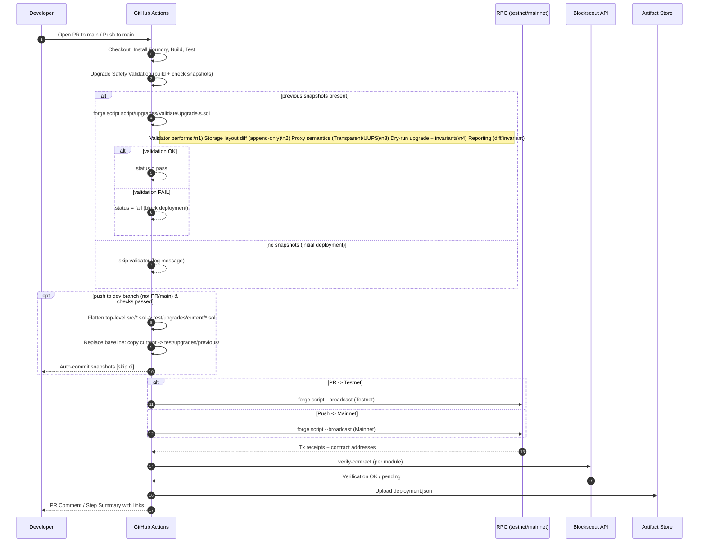
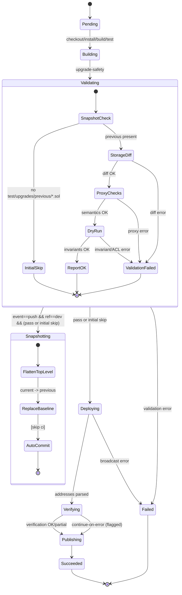
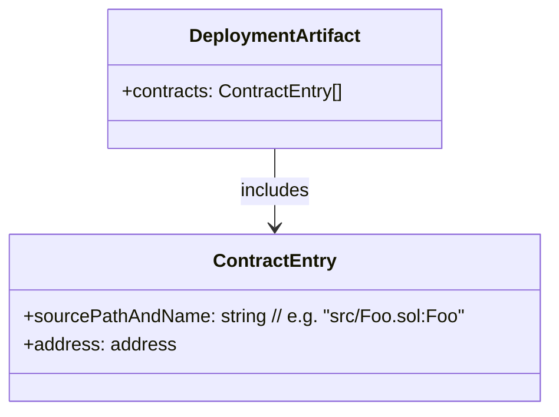

# Technical Spec — Auto CI/CD: Testnet & Mainnet Deployments (Foundry + Blockscout)

## 1. Background

### Problem Statement: What hurts today?

* Manual, inconsistent deployments of smart contracts across environments.
* Frontend team might be blocked by contract deployment details.
* Risky upgrades without automated safety checks.
* Fragmented verification (Etherscan vs Blockscout) and inconsistent artifacts/summaries.

### Context / History

* Current repo uses Foundry for build/test and deployment (`forge`, `cast`, `forge script`).
* Reference workflows provided for:

  * **Testnet**: deploy on PR to `main`.
  * **Mainnet (configurable)**: deploy on push/merge to `main` under a protected environment.
  * **Upgrade safety validation** via flattened previous/current contracts and `script/upgrades/ValidateUpgrade.s.sol`.
  * **Flattening** On pushes to dev only (after tests and upgrade-safety pass), CI flattens all top-level contracts in `src/` to `test/upgrades/current/`, then backs up that snapshot to `test/upgrades/previous/` and auto-commits the changes.
* Direction: **adopt Blockscout verification** and **drop Etherscan** support.
* Intended to be reused across multiple repos; not for continuous auto-upgrades of production, but to guarantee end-to-end deployability and unblock frontends.

### Standardized Deployment Script

To make workflows reusable across repos, CI expects a **canonical wrapper**:

- **Entry point (name):** `script/Deploy.s.sol:Deploy`
- **Behavior:** Reads the target deploy task from an env var and delegates to contract-specific script(s).
  - Env: `DEPLOY_TARGET` (e.g., `ButteredBread`, `NFTMultiplier`, etc.)
  - Env: `RPC_URL`, `PRIVATE_KEY`
  - Optional Env: `PROXY_ADMIN_ADDRESS`
- **Invocation (canonical):**
  ```bash
  forge script script/Deploy.s.sol:Deploy \
    --rpc-url "$RPC_URL" \
    --broadcast \
    --slow \
    -vvvv
  ```

**Broadcast artifact contract:** CI will parse the Foundry broadcast artifact to extract deployed addresses.

  ```json
  {
    "contracts": [
      { "sourcePathAndName": "src/Foo.sol:Foo", "address": "0x..." }
    ]
  }
  ```

* **Deploy script (example):**

```solidity
// SPDX-License-Identifier: MIT
pragma solidity ^0.8.25;

import "forge-std/Script.sol";
import "forge-std/console2.sol";

contract Deploy is Script {
  function run() external {
    string memory target = vm.envString("DEPLOY_TARGET"); // e.g., "ButteredBread"
    require(bytes(target).length != 0, "DEPLOY_TARGET required");

    uint256 pk = vm.envUint("PRIVATE_KEY");
    require(pk != 0, "PRIVATE_KEY required");

    vm.startBroadcast(pk);

    if (keccak256(bytes(target)) == keccak256("ButteredBread")) {
      // ... deploy your implementation + proxy here ...
    } else {
      revert("Unknown DEPLOY_TARGET");
    }

    vm.stopBroadcast();
  }
}

```

### Stakeholders

* **Smart Contracts Team** — authors of contracts and deployment scripts.
* **DevOps** — maintain GitHub Actions, secrets, and environment protections.

---

## 2. Motivation

### Goals & Success Stories

* **On every PR to `main`:** build, test, upgrade-safety validate, deploy to **testnet**, verify on **Blockscout**, publish addresses + explorer links in **PR comment** and **Step Summary**, and upload **deployment artifacts**.
* **On merge/push to `main`:** run the same pipeline against **mainnet (configurable)** under a protected environment. The job must not change the production proxy’s implementation. It may deploy a new implementation or a separate staging proxy for validation. All production upgrades remain manual and explicit.
* **Upgrade-safety validation** runs on pushes to dev/main, PRs to/from branches with 'release' or to dev/main, or manual trigger. This is to prevent unsafe upgrades before they hit production.
* **Repeatability:** workflows are copy/paste-able across repos with minimal variable changes.
* **Artifact schema:** every deployment emits one JSON containing, per contract:`sourcePathAndName`, `address`.

---

## 3. Scope and Approaches

### Non-Goals

* Automatic continuous upgrades of production on every commit (we deploy on `main` merges, not continuously).
* Updating the production proxy implementation automatically on every merge. Production upgrades remain manual/explicit.
* Extensive security auditing (we only include upgrade-safety & verification checks here).
* Changing ProxyAdmin ownership or production proxy state via CI (out of scope).
* On-chain migrations or data transforms (out of scope).

### Technical Functionality / Off-Scope Reasoning / Tradeoffs

| Technical Functionality      | Reasoning for being off scope                           | Tradeoffs                                              |
| ---------------------------- | ------------------------------------------------------- | ------------------------------------------------------ |
| Automated prod rollback      | Requires on-chain state awareness and migration tooling | Manual rollback plan only (documented below)           |
| Canary/mainnet shadow deploy | Adds cost & complexity                                  | Keep pipeline lean; rely on testnet for pre-prod       |
| Multi-network matrix         | Increases flakiness and runtime                         | Start with two networks, expand later                  |
| Etherscan verification       | Direction is Blockscout standardization                 | One verifier reduces variance; Etherscan features lost |

### Value Proposition

| Technical Functionality      | Value                                   | Tradeoffs                                    |
| ---------------------------- | --------------------------------------- | -------------------------------------------- |
| Foundry build/test on CI     | Early failure detection                 | Longer CI runtime                            |
| Upgrade-safety validation    | Prevents breaking upgrades              | Requires keeping flattened snapshots current |
| Auto-deploy on PR (testnet)  | Frontend unblock, end-to-end validation | Funds & RPC cost on testnet                  |
| Auto-deploy on main (configurable) | Consistent prod releases                | Needs strong environment protection & keys   |
| Blockscout verification      | Public, fast verification               | Blockscout indexing variability              |
| Deployment artifacts (JSON)  | Single source of truth for frontends    | Must keep schema stable                      |
| PR comments + step summary   | High visibility, easy review            | Slightly more CI scripting                   |
| Upgradeable deployments (proxy)   | Safe, repeatable upgrades; production proxy untouched by default | Additional moving parts (proxy admin, impl); stricter validation needed |

### Alternative Approaches

| Approach                                     | Pros                   | Cons                                          |
| -------------------------------------------- | ---------------------- | --------------------------------------------- |
| Single monolithic workflow with conditionals | Fewer files            | Harder to read/maintain; more branching logic |
| Hardhat instead of Foundry                   | Familiar to some teams | Slower builds; mixed tooling                  |
| Keep Etherscan for testnet                   | Familiar UX            | Split verification logic; higher maintenance  |
| Manual-only deploys                          | Safety                 | Slower feedback, prone to human error         |

---

## 4. Step-by-Step Flow

### 4.0 Upgrade-Safety & Snapshot Policy (Authoritative)

**Triggers**

* **Upgrade-safety job runs on**:

  * `workflow_dispatch`
  * any `push`
  * `pull_request` where **base** ∈ {`dev`,`main`} **or** `head`/`base` contains `'release'`
* **Flatten & auto-commit job runs only on**:

  * `push` to `dev` (not PRs, not `main`), **after** tests and upgrade-safety pass

**Upgrade-safety behavior**

1. `forge clean && forge build`
2. If `test/upgrades/previous/*.sol` exists, run `script/upgrades/ValidateUpgrade.s.sol`.
   Else → **skip** (initial deployment; no baseline available).

**Snapshot/flatten behavior (dev-only)**

1. Flatten `src/*.sol` to `test/upgrades/current/*.sol`
2. Replace baseline: delete `test/upgrades/previous/`, copy `current` to `previous`
3. **Auto-commit** changes under `test/upgrades/**/*.sol` with message
   `chore: auto-flatten contracts after validation passes [skip ci]`

### 4.1 Main (“Happy”) Paths

#### Path A — PR to `main` (Testnet)

**Pre-condition:** PR opened or updated targeting `main`; secrets configured; deploy wallet funded on the selected **testnet**.

1. **CI triggers** on `pull_request` to `main`.
2. **Checkout** repo with submodules; **Install Foundry**; **forge install**; **forge build**; **forge test -vvv**.
3. **Upgrade-safety validation** runs (`forge build`; check `test/upgrades/previous`; run `script/upgrades/ValidateUpgrade.s.sol` if present).
4. **Deploy (upgradeable)** via `forge script` (entry: `script/Deploy.s.sol:Deploy`) using a proxy pattern (UUPS/Transparent). Create or upgrade a **testnet** proxy but never touch **mainnet** production proxy. Secrets: `TESTNET_PRIVATE_KEY`, `TESTNET_RPC_URL`.
5. **Parse deployed addresses** from Foundry’s broadcast artifact.
6. **Verify** each contract on **Blockscout** (**testnet**) with correct compiler metadata & constructor args; wait for indexing (sleep with backoff).
7. **Summarize** in `$GITHUB_STEP_SUMMARY` (Markdown table with explorer links).
8. **Save artifacts** to `deployments/testnet/deployment.json` including, for each contract: `sourcePathAndName`, `address`.
9. **Comment on PR** with addresses + links.
   **Post-condition:** PR contains validated, verified testnet deployment with artifacts.

#### Path B — Push/Merge to `main` (Mainnet)

**Pre-condition:** Protected `production` environment (optional manual approval); deploy wallet funded on the selected **mainnet**.

1. **CI triggers** on `push` to `main`.
2. Same steps 2–3 as Path A.
3. **Deploy (non-disruptive & upgradeable)** via `forge script` (entry: `script/Deploy.s.sol:Deploy`) to **mainnet** with `MAINNET_PRIVATE_KEY`, `MAINNET_RPC_URL`. Deploy a staging proxy+implementation or deploy a new implementation only for upgrade validation. Do not point the production proxy to the new implementation automatically.
4. **Parse broadcast artifact** (`run-latest.json`) for addresses, **verify on Blockscout (mainnet)**, **summarize**, and write `deployments/mainnet/deployment.json` with `{ sourcePathAndName, address }` per contract.

#### Upgrade-safety — Required checks (must pass)

* Storage layout is append-only: no slot reorder/overwrite; only new vars appended in the same inheritance order.
* Initializer gating: implementation contracts have initializers disabled (or guarded); no re-initialization.
* Proxy semantics: for Transparent, admin vs user calls behave correctly; for UUPS, proxiableUUID() matches and upgradeTo* is restricted.
* Dry-run upgrade: simulate pointing the proxy to the new impl; run invariants/smoke tests (e.g., read critical state, role ACLs) without owner overrides.
* Report: on fail, emit which rule failed and a storage diff; block deployment job.

### 4.2 Alternate / Error Paths

| #  | Condition                       | System Action                | Suggested Handling                                                                                |
| -- | ------------------------------- | ---------------------------- | ------------------------------------------------------------------------------------------------- |
| A1 | Missing secrets                 | Job fails early              | Fail fast with clear log; doc required secrets                                                    |
| A2 | RPC outage / rate limit         | Deploy/verify step fails     | Auto-retry (limited), otherwise fail with guidance                                                |
| A3 | Blockscout indexing slow        | Verify timeouts              | Bounded backoff (e.g., 3 attempts). If still pending, mark “Verification pending” in summary and succeed the job. |
| A4 | Upgrade-safety fails            | Block deploy jobs            | Mark PR red; link to diff and validator logs                                                      |
| A5 | Foundry toolchain install error | Build step fails             | Re-run workflow; pin known-good versions                                                          |
| A6 | Submodule fetch error           | Checkout fails               | Ensure `submodules: recursive`; fallback to `fetch-depth: 0`                                      |
| A7 | Gas/nonce issues                | Broadcast fails              | Use `--slow` and clean nonce; document funding and nonce hygiene                                  |
| A8 | Parsing broadcast artifact fails| Missing addresses in outputs | Fail with a clear message and attach `broadcast/*/run-latest.json`                                |
| A9 | Artifact upload fails           | Missing artifacts in run     | Re-upload step; store to workspace before upload                                                  |
| A10 | No `test/upgrades/previous/*.sol` baseline | Validator skipped | Log as “initial deployment”; baseline will be set on next successful `dev` push                  |

---

## 5. UML Diagrams







---

## 6. Edge cases and concessions

* **Blockscout indexing lag**: we add waits/backoff. Verification may be marked as “pending” in summary and retried by re-running workflow.
* **Constructor args**: pulled via `cast abi-encode` from network config (`config/testnet.json`, `config/mainnet.json`). Any schema drift breaks verification.
* **Compiler version**: must extract from artifact metadata to avoid “bytecode mismatch”.
* **Flatten snapshots**: Only top-level contracts in `src/`. Nested contracts or libs require explicit inclusion if needed by validator.
* **Gas spikes**: `--slow` and realistic gas price; can add `--with-gas-price` override via env if necessary.
* **Multiple repos**: Paths and names must be parameterized; we’ll centralize runner snippets where possible.

---

## 7. Open Questions

1. **Environment protections**: Do we require manual approval for `production`? Who are approvers?
2. **Wallet management**: Custody of `MAINNET_PRIVATE_KEY` & `TESTNET_PRIVATE_KEY` (rotation cadence, funding, policy)?
3. **RPC providers**: Which providers (rate limits/SLA)? Fallback RPC?
4. **Artifact schema**: Do frontends need ABI pointers/hashes in `deployment.json`? Add `abiPaths`?
5. **Partial verification**: If some modules verify and others are pending, do we block the run or allow success with warnings?
6. **Static analysis**: Do we integrate `slither`/`solhint` gates now or later?
7. **Upgrade validator inputs**: Any proxies/initializers that require special handling in `ValidateUpgrade.s.sol`?
8. **Proxy pattern:** Use Transparent Proxy for now (UUPS allowed per-repo but must pass the same upgrade-safety checks)?
9. **Staging vs production separation:** Default to deploying a staging proxy or new impl address on mainnet without wiring it to the production proxy?
10. **Artifact granularity:** do we store both proxy and implementation entries for every upgrade, with kind?

---

## 8. Glossary / References

* **Foundry** — Ethereum development toolkit providing `forge` (build, test, deploy, verify) and `cast` (RPC and ABI utilities).
* **Blockscout** — Open-source block explorer and verification API used for contract verification (testnet/mainnet).
* **Upgrade-safety validation** — CI step that compares flattened previous vs current contract sources and runs `script/upgrades/ValidateUpgrade.s.sol` to detect unsafe storage or proxy changes before deployment.
* **Deployment artifacts** — Canonical JSON outputs stored under `deployments/{network}/deployment.json`, containing deployed contract addresses, source paths, and metadata consumed by frontends.
* **GitHub Environments** — Protected configuration contexts (`testnet`, `production`) that store secrets (RPC URLs, private keys) and can require manual approvals for mainnet deployments.